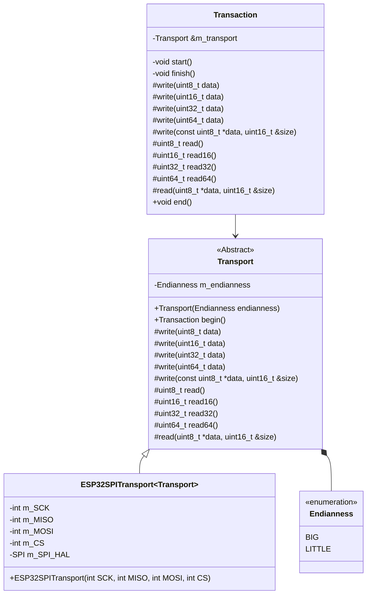

```mermaid
classDiagram
    class Endianness{
        <<enumeration>>
        BIG
        LITTLE
    }

    class Transport{
        <<Abstract>>
        -Endianness m_endianness
        +Transport(Endianness endianness)
        +Transaction begin()

        #write(uint8_t data)
        #write(uint16_t data)
        #write(uint32_t data)
        #write(uint64_t data)
        #write(const uint8_t *data, uint16_t &size)

        #uint8_t  read()
        #uint16_t read16()
        #uint32_t read32()
        #uint64_t read64()
        #read(uint8_t *data, uint16_t &size)
    }

    %% Transaction class will directly call their m_transport write / read / ...
    class Transaction{
        -Transport &m_transport

        -void start()
        -void finish()

        #write(uint8_t data)
        #write(uint16_t data)
        #write(uint32_t data)
        #write(uint64_t data)
        #write(const uint8_t *data, uint16_t &size)

        #uint8_t  read()
        #uint16_t read16()
        #uint32_t read32()
        #uint64_t read64()
        #read(uint8_t *data, uint16_t &size)

        +void end()
    }

    class ESP32SPITransport~Transport~{
        -int m_SCK
        -int m_MISO
        -int m_MOSI
        -int m_CS
        -SPI m_SPI_HAL
        +ESP32SPITransport(int SCK, int MISO, int MOSI, int CS)

    }

    Transport <|-- ESP32SPITransport
    Transaction --> Transport
    Transport *--Endianness

```